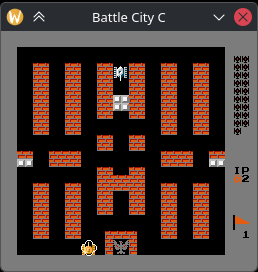

# Battle City — C Port

[🇬🇧 English version](README.md)

Портирование оригинальной **Battle City** (NES, 1985) на C. Исходный код — точный перенос дизассемблера из репозитория [romhack/battle-city-disassembly](https://github.com/romhack/battle-city-disassembly). Каждая функция, ветвление и побочный эффект сверены с оригинальным ASM.



## Состояние проекта

Сверено **114** функций из **218** (по `PORTING.md`).

## Сборка

```bash
cmake -B build -S .
cmake --build build
```

Зависимости: **SDL2** (библиотека + заголовки).

### Сборка с SDL3

```bash
cmake -B build -S . -DUSE_SDL3=ON
cmake --build build
```

Требуется установленная **SDL3** (библиотека + заголовки).

## Запуск

```bash
./build/battle_city
```

### Параметры командной строки

| Параметр | Описание |
|---|---|
| `--region ntsc` | NTSC-тайминг (по умолчанию). CPU 1.789 МГц, 60 FPS |
| `--region pal` | PAL-тайминг. CPU 1.662 МГц, 50 FPS |
| `--apu-filters` | Включить цепочку аппаратных фильтров NES: HPF 90 Hz → HPF 440 Hz → LPF 14 kHz. Без флага — простой DC-removal HPF (~28 Hz) |
| `--scale N` | Масштаб окна (1–10, по умолчанию: 1) |

Пример:
```bash
./build/battle_city --region pal --apu-filters
```

### Управление

| Клавиша | Действие |
|---|---|
| `Z` | B (выстрел) |
| `X` | A (меню) |
| `Right Shift` | Select |
| `Enter` | Start |
| `↑ ↓ ← →` | D-pad |

## CHR-данные

Тайлы (CHR) встроены в бинарник на этапе сборки (CMake `file(READ ... HEX)`) — игра запускается без внешних файлов.

При необходимости можно загрузить CHR из файлов на диске. Поддерживаются два формата:

| Файл | Описание |
|---|---|
| `data/chr.bin` | Бинарный CHR-ROM (16 КБ). Дамп нужно получить самостоятельно из оригинального ROM (например, через `dd` или NES-эмулятор) |
| `data/chr.bmp` | BMP-изображение 128×256 (512 тайлов 8×8), 8-bit grayscale. Верхние 128×128 — банк спрайтов (тайлы 0–255), нижние 128×128 — банк фона (тайлы 256–511). Каждый пиксель конвертируется в NES 2bpp по интенсивности |

Порядок загрузки: `chr.bin` → `chr.bmp` → встроенный BMP.

## Структура проекта

```
├── CMakeLists.txt
├── data/
│   └── chr.bmp              # BMP-тайлы 128×256 (альтернатива .bin)
├── src/
│   ├── main.c               # точка входа, парсинг аргументов
│   ├── sdl_init.c/h         # инициализация SDL2: окно, аудио, семафоры
│   ├── sdl_run.c/h          # главный цикл: рендер, тайминг, game thread
│   ├── game/                # игровая логика (портированный ASM)
│   │   ├── battle_*.c       # экран боя: танки, пули, бонусы, коллизии
│   │   ├── *_screen.c       # экраны: титул, выбор стадии, game over, рекорды
│   │   ├── nmi.c/h          # NMI-обработчик, джойпад, платформенные абстракции
│   │   ├── sound_engine.c   # музыкальный движок (интерпретатор ROM-треков)
│   │   ├── zeropage.c/h     # переменные NES zero-page
│   │   ├── bss.c/h          # BSS-переменные
│   │   └── ...
│   └── nes/                 # эмуляция NES-железа
│       ├── apu_sim.c/h      # симуляция APU: pulse, triangle, noise, микшер
│       ├── ppu_sim.c/h      # симуляция PPU: VRAM, рендер в framebuffer
│       ├── config.c/h       # регион-зависимые параметры (NTSC/PAL)
│       ├── chr_load.c/h     # загрузка CHR из файла или встроенного BMP
│       └── poweron_randomize.c/h  # инициализация памяти при старте
├── build/                   # бинарник + скомпилированные данные
├── PORTING.md               # чеклист портированных функций
└── AGENTS.md                # правила портирования
```

### Архитектура

- **`game/`** — платформенно-независимая логика игры. Прямой перенос ASM с сохранением структуры меток, `goto` для ветвлений и fallthrough.
- **`nes/`** — эмуляция NES-чипов: APU (audio), PPU (graphics), регион-зависимые параметры.
- **`sdl_init.c` / `sdl_run.c`** — слой SDL2: инициализация окна, аудиоустройства, семафоров, опрос контроллеров, главный цикл.
- APU и PPU общаются с `game/` через прямые вызовы (`apu_write`, `ppu_data_write`), без callback-регистрации.
- APU использует lock-free ring buffer (SPSC) для передачи регистровых записей из game thread в audio callback.

### Запись в регистры APU и PPU

**APU** — lock-free SPSC ring buffer. Game thread вызывает `apu_write(reg, value)`, `apu_write_status(value)`, `apu_write_frame(value)` — данные помещаются в кольцевой буфер (`ring_push`) с `atomic_store` (release). Audio callback (`audio_callback`) — единственный потребитель: загружает события через `atomic_load` (acquire) и применяет их к состоянию каналов. Никаких блокировок в hot path.

**PPU** — прямые вызовы. `ppu_data_write(addr, val)` записывает в эмулированную VRAM (16 КБ) с учётом зеркалирования nametable ($2000–$2FFF) и правил палитры ($3F00–$3FFF). Экран обновляется через буфер `Screen_Buffer`: игра заполняет его парами `(addr_hi, addr_lo, val...)`, `update_screen()` в NMI разбирает буфер и вызывает `ppu_data_write` для каждой записи.

### NMI и VBlank

На реальном NES прерывание NMI генерируется PPU в начале vblank. В порте это эмулируется через **два потока и семафоры**:

- **Game thread** (`nes_thread`) — выполняет игровую логику. При вызове `nmi_wait()` устанавливает атомарный флаг `game_in_nmi_wait = 1` и блокируется на семафоре `wake_sem`.
- **Render thread** (`sdl_run`) — работает в цикле с фиксированным FPS (60 NTSC / 50 PAL). Каждый кадр:
  1. Выставляет vblank-флаг в PPU и постит `vblank_sem` (для тех, кто ждёт vblank через `vblank_wait()`).
  2. Если `game_in_nmi_wait == 1` — рендерит кадр (`ppu_render` → SDL present), вызывает `nmi()`, затем постит `wake_sem` — game thread разблокируется.
  3. Если `game_in_nmi_wait == 0` — просто обновляет экран и вызывает `play_sound()`.

Таким образом, `nmi()` вызывается **строго в render thread** один раз за кадр, а game thread синхронизируется с ним через пару семафоров (`wake_sem` / `vblank_sem`). `plat_running` и `game_exit_buf` (longjmp) обеспечивают корректный выход при закрытии окна.

## Инструкции

- `AGENTS.md` — правила портирования: точное соответствие ASM, управление потоком (`goto`/fallthrough), именование, типы данных, сборка
- `PORTING.md` — чеклист всех top-level функций из дизассемблера с маппингом на C-функции и статусом сверки

## Лицензия

Оригинальная Battle City — собственность Nintendo (1985). Данный порт создан в образовательных целях.

## ИИ-ассистенты

Проект разработан при участии ИИ-ассистентов: Claude, Gemini, ChatGPT, Qwen.
